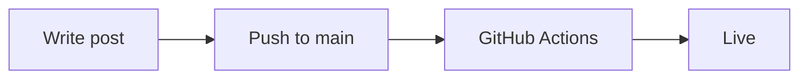

# Mizuki Design System

A personal blog built with Astro 5 and Svelte 5, featuring a hue-driven design system, ambient effects, and a full media tracking setup.

## Features

| Feature | Details |
|---------|---------|
| Hue-driven theming | Entire site retints from a single `--hue` CSS variable. Palette picker in navbar. |
| Dark / light mode | Persisted via localStorage |
| Blog posts | Markdown with frontmatter, tags, categories, series, password-gating |
| Mermaid diagrams | Fenced ` ```mermaid ``` ` blocks render as SVG in posts |
| Search | Client-side full-text search across titles, descriptions, tags |
| View counter | Per-post view counts via counterapi.dev |
| Comments | Giscus (GitHub Discussions-backed), theme-synced |
| Guestbook | Form submissions via Web3Forms |
| Anime tracking | AniList widget + Simkl stats |
| Movie tracking | Simkl watchlist |
| Music | Last.fm now-playing + full listening history page |
| Discord status | Live presence widget |
| Atmosphere | Rain, fog, fireflies, sakura, ambient music loops |
| CyberBot | Animated desktop mascot with physics |
| RSS feed | `/rss.xml` |
| Sitemap | Auto-generated |

## Setup

```bash
npm install
npm run dev
```

## Environment variables

Create a `.env` file (gitignored) with any of these:

```env
# Guestbook — get a free key at web3forms.com
PUBLIC_WEB3FORMS_KEY=your_key_here

# Simkl — run scripts/simkl-auth.mjs once to populate
SIMKL_ACCESS_TOKEN=your_token_here

# Last.fm — get a key at last.fm/api
PUBLIC_LASTFM_API_KEY=your_key_here
```

## Configuration

Everything else lives in `src/config.ts`:

```ts
SITE          // title, description, URL, OG image
AUTHOR        // name, bio, avatar, social links
LASTFM        // username
DISCORD_USER_ID
ANILIST_USER
GISCUS        // repo, repoId, category, categoryId (from giscus.app)
YOUTUBE       // playlist ID for music page
SIMKL         // user ID and client ID
ANNOUNCEMENT  // banner widget
NAV_LINKS     // navbar structure
```

## Writing posts

Add `.md` files to `src/content/posts/`. Frontmatter fields:

```yaml
---
title: "Post title"
titleTinted: "highlighted word"   # optional coloured suffix
description: "Short summary"
published: 2026-01-01
category: "Life"
tags: ["tag1", "tag2"]
readTime: "5 min"
image: "/assets/posts/my-image.jpg"   # optional cover
password: "secret"                     # optional password gate
draft: true                            # hides from index
---
```

### Mermaid diagrams

````md

````

## Deployment

Deploys automatically to GitHub Pages via `.github/workflows/deploy.yml` on push to `main`.

For secrets used at build time (e.g. `SIMKL_ACCESS_TOKEN`), add them in **GitHub repo → Settings → Secrets and variables → Actions**.

## Tech stack

| Layer | Technology |
|-------|-----------|
| Framework | Astro 5 |
| Components | Svelte 5 (runes) |
| Styling | CSS custom properties + OKLCH color |
| Deployment | GitHub Pages |
| Comments | Giscus |
| Forms | Web3Forms |
| View counts | counterapi.dev |
| Diagrams | remark-mermaidjs |
