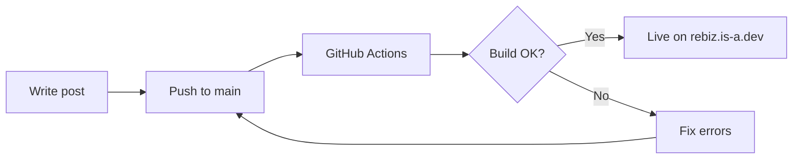
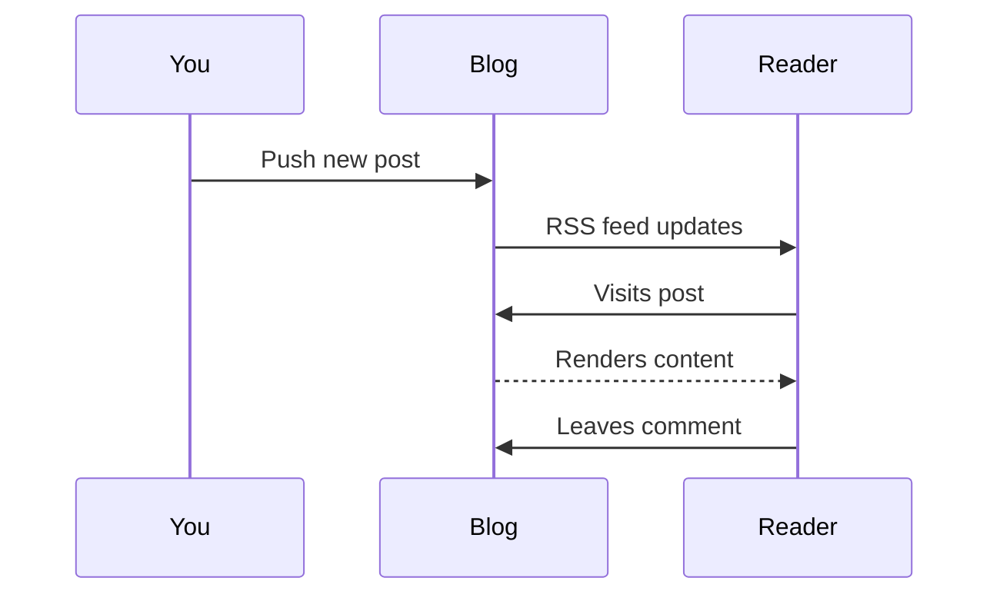
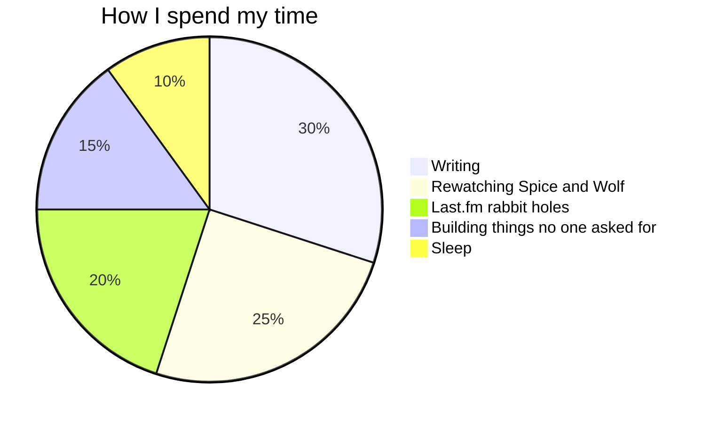

## Flowchart

```mermaid
flowchart LR
  A[Write post] --> B[Push to main]
  B --> C[GitHub Actions]
  C --> D{Build OK?}
  D -- Yes --> E[Live on rebiz.is-a.dev]
  D -- No --> F[Fix errors]
  F --> B
```

## Sequence diagram

```mermaid
sequenceDiagram
  participant You
  participant Blog
  participant Reader

  You->>Blog: Push new post
  Blog->>Reader: RSS feed updates
  Reader->>Blog: Visits post
  Blog-->>Reader: Renders content
  Reader->>Blog: Leaves comment
```

## Pie chart

```mermaid
pie title How I spend my time
  "Writing" : 30
  "Rewatching Spice and Wolf" : 25
  "Last.fm rabbit holes" : 20
  "Building things no one asked for" : 15
  "Sleep" : 10
```
